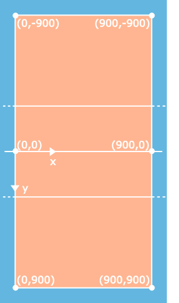

# VBRotations

VBRotations is a toolkit for generating interactive SVGs that can be used to teach Volleyball positional play.  It started as a tutorial for teaching a typical 5-1 rotation system,
but the API can be used to generate your own tutorials, demonstrations of drills or scenarios. You can see VBRotations in action in [here](https://monkeysppp.github.io/VBRotations)

VBRotations is built using [Snap](http://snapsvg.io).

# Using VBRotations

## Example

The simple example below shows how to create a VBCourt, attach it to a div element in the DOM, add some players to the court and then draw the SVG.

There are some more complex examples in the [examples](/examples) folder which show how to animate the court, players and ball.

```html
<html>
  <head>
    <meta http-equiv="Content-Type" content="text/html; charset=utf-8">
    <title>Volleyball Rotations</title>
    <!-- Pull in the source files -->
    <script src="src/js/snap.svg-min.js"></script>
    <script src="src/js/vbCourts.js"></script>
    <script type="text/javascript">
      // Clean up the div element to make sure our SVG will be the only child
      function clean(elem) {
        while (elem.firstChild) {
            elem.removeChild(elem.firstChild)
        }
      }

      window.onload = function () {
        const courtDiv = document.getElementById('court'); // find the div element
        const vbCout = new VBHalfCourt({ // create the VBCourt object
          width: 550
        })
        clean(courtDiv)
        courtDiv.appendChild(vbCout.getSVG()) // get the SVG and attach to our dev element
        const p4 = vbCout.addPlayer(200, 100, '4') // add some players to the court
        const p3 = vbCout.addPlayer(450, 100, '3')
        const p2 = vbCout.addPlayer(700, 100, '2')
        const p5 = vbCout.addPlayer(200, 500, '5')
        const p6 = vbCout.addPlayer(450, 700, '6')
        const p1 = vbCout.addPlayer(700, 500, '1')
        vbCout.draw() // draw the court and the players
      }
    </script>
  </head>
  <body>
    <!-- Create a div element to attach the SVG onto -->
    <div id="court"></div>
  </body>
</html>
```

## API

### `VBCourt`

The `VBCourt` classes are in the source file `src/js/vbCourts.js`.  These are a set of basic building blocks that enable you to draw a court (half or full court), populate that court with players and balls, and to move those around the court.  They can be used to show static situations, dynamic situations, the flow of a drill, maybe even making your own arcade game.

#### `new VBHalfCourt(courtConfig)`

Create a new `VBHalfCourt`.  The `VBHalfCourt` is a `VBCourt` object that represents a single side of the court, and is one of the main objects you will interact with.  It
generates an SVG image of a requested width and a height equal to the width.

_returns_ `VBHalfCourt` Object (type of `VBCourt`)

_parameters_

| Name | Type | Required | Description | Default |
| --- | --- | --- | --- | --- |
| courtConfig | Object | optional | An object that defines the properties of the SVG (see below) | {} |

_example_

```js
const court = new VBHalfCourt()
```

---

#### `new VBFullCourt(courtConfig)`

Create a new `VBFullCourt`.  The `VBFullCourt` is a `VBCourt` object that represents a full court area, and is one of the main objects you will interact with.  It generates an SVG
image of a requested width and a height equal to 20/11 times the width.

_returns_ `VBFullCourt` Object (type of `VBCourt`)

_parameters_

| Name | Type | Required | Description | Default |
| --- | --- | --- | --- | --- |
| `courtConfig` | Object | optional | An object that defines the properties of the SVG (see below) | {} |

_example_

```js
const court = new VBFullCourt({ width: 500 })
```

---

#### `courtConfig`

You can pass in a config object when creating a `VBCourt` object.  The config object has the fields listed below.  All fields are optional, and the object below contains the
default values for each field:

```
{
  width: 900 // A number setting the width in pixels.
             // The height will always be 8/9ths the width.
  colours: {
    backgroundColour: '#63b6e0' // a string containing the hex colour to use for the background of the SVG
    courtColour: '#ffb591'      // a string containing the hex colour to use for the court in the SVG
    lineColour: '#ffffff'       // a string containing the hex colour to use for the lines in the SVG
  }
}
```

_example_

```js
const court = new VBFullCourt({
  width: 500,
  colours: {
    backgroundColour: #ffffff,
    courtColour: #ffffff,
    lineColour: #000000
  }
})
```

---

#### `VBCourt.getSVG()`

Once you have a `VBCourt` object, you will want to get the SVG it generates and attach to an element in your HTML DOM tree.  You could even save that SVG object.

_returns_ An SVG DOM element you can attach to your HTML DOM tree

_example_

```js
const court = new VBFullCourt({ width: 500 })
document.getElementById('court').appendChild(court.getSVG())
```

---

#### `VBCourt.addPlayer(x, y, label)`

This adds a single player to the `VBCourt` object.  You can add as many players as you like, and use `setPosition()` to move them as needed.

_returns_ `Player` Object (type of `CourtObject`)

_parameters_

| Name | Type | Required | Description | Default |
| --- | --- | --- | --- | --- |
| `x`, `y` | number | optional | The x and y coordinates to start the player at (see below for the coordinate system) | 0, 0 |
| `label` | string | optional | The text to put in the player tile.  There is nothing stopping you putting a long string here, but it would look weird. | 'X' |

_coordinate system_

- The coordinate system has the origin `(0,0)` at the left post of the court and counts `x` as increasing to the right and `y` increasing _downwards_.
- The coordinate uses 100 as equivalent to 1 metre, irrespective of the SVG width, so a single half-court is 900 by 900 units
- The court has 100 units border on each edge; you can use coordinates beyond the court limits, but the player may be drawn beyond the edges of the SVG image
- For the `VBFullCourt`:
  - the top court coordinates are from top-left `(0,-900)` to bottom-right `(900,0)`,
  - the bottom courts are from top-left `(0,0)` to bottom-right `(900,900)`
- For the `VBHalfCourt`, the court coordinates are the same as the bottom court on a `VBFullCourt`



_example_

```js
const court = new VBFullCourt()
court.addPlayer(700, 100, 'S1') // add a setter at 2 on the bottom court
court.addPlayer(200, -100, 'S2') // add a setter at 2 on the top court
```

---

#### `VBCourt.addBall(x, y)`

This adds a single ball to the `VBCourt` object.  You can add as many balls as you like, and use `setPosition()` to move them as needed.

_returns_ `Ball` Object (type of `CourtObject`)

_parameters_

| Name | Type | Required | Description | Default |
| --- | --- | --- | --- | --- |
| `x`, `y` | number | optional | The x and y coordinates to start the ball at.  This uses the same coordinate system as for `addPlayer()` (see above) | 0, 0 |

_example_

```js
const court = new VBFullCourt()
court.addPlayer(650, 950, 'Sv') // add a player at 1 waiting to serve
court.addBall(650,910) // add a ball to the server
```

---

#### `VBCourt.draw(time)`

On the first call to `draw()`, the SVG will be populated with the court (`VBCourt`), the players and balls (`CourtObjects`) in their initial positions.

You can then make calls to `setPosition()` to set the next position of each court object.  On the next call to `draw()`, all of the `CourtObjects` will be animated moving to their new positions.  The `time` parameter controls how long (in milliseconds) that the animation lasts for.

NB: Every `Ball` will always be drawn on the layer above of all `Players` (a ball should never disappear behind a player)
NB: Calling `draw()` while a draw animation is in progress will return the promise for the currently active animation step

_returns_ `Promise` that resolves when the drawing animation has completed

_parameters_

| Name | Type | Required | Description | Default |
| --- | --- | --- | --- | --- |
| time | number | optional | The time in milliseconds to spend animating the movement of the `CourtObjects` | 600 |

_example_

```js
const court = new VBHalfCourt({ width: 500 }) // create a court
document.getElementById('court').appendChild(court.getSVG()) // attach the court's SVG to the DOM
const player = court.addPlayer(700, 100, 'S1') // add a setter at 2 on the bottom court
court.draw()                                   // draw the initial court and player
player.setPosition(700, 300)                   // set the player to drop off the net
court.draw(500)                                // animate the court objects to their new positions in 500ms
```

---

#### `CourtObject.setPosition(x, y)`

Sets the next position for the `CourtObject` when the next call to `draw()` is made.

_parameters_

| Name | Type | Required | Description | Default |
| --- | --- | --- | --- | --- |
| `x`, `y` | number | optional | The x and y coordinates to move the `CourtObject` to.  This uses the same coordinate system as for `addPlayer()` (see above) | 0, 0 |

_example_ - see example for `VBCourt.draw(time)`

---

#### `Player.toggleHighlight()`

A call to `toggleHighlight()` causes the background colour of that player tile to toggle between the standard background colour and the highlight colour.

_example_

```js
const court = new VBHalfCourt({ width: 500 }) // create a court
document.getElementById('court').appendChild(court.getSVG()) // attach the court's SVG to the DOM
const player = court.addPlayer(700, 100, 'S1') // add a setter at 2 on the bottom court
court.draw()                                   // draw the initial court and player
player.toggleHighlight()                       // toggle the player's background colour
```

---

### `VBTutorials`

The `VBTutorials` classes are built on top of the `VBCourt` classes, and provide a set of standard tutorials for demonstrating some of the common systems and scenarios found in Volleyball.

#### `new VBTutorialServeReceieve(tutorialConfig)`

Create a new `VBTutorialServeReceieve` object.  This can be used to demonstrate a typical 5-1 volleyball rotation system and includes controls for the student to click and watch as the players move around the court.

_returns_ `VBTutorialServeReceieve` object (type of `VBTutorial`)

_parameters_

| Name | Type | Required | Description | Default |
| --- | --- | --- | --- | --- |
| `tutorialConfig` | Object | optional | An object that defines the properties of the SVG (see below) | {} |

_example_

```js
const serveReceiveTutorial = new VBTutorialServeReceieve()
document.getElementById('vbTutorialDiv').appendChild(serveReceiveTutorial.getSVG())
serveReceiveTutorial.draw()
```

---

_tutorialConfig_

You can pass in a config object when creating a VBTutorialServeReceieve object.  The config object has the following values, with all fields being optional:

```
{
  width: 900 // A number setting the width in pixels.
             // The height will always be 8/9ths the width.
  language: 'en' // A string with one of the values en|de|es|fr|it|nl|pl
                 // Defaults to en
}
```

---

#### `VBTutorial.getSVG()`

Once you have a `VBTutorial` object, you will want to get the SVG it generates and attach to an element in your HTML DOM tree.  You could even save that SVG object.

_returns_ An SVG DOM element you can attach to your HTML DOM tree

---

#### `VBTutorial.draw()`

Populates the SVG with all of the tutorial objects.  This only needs to be called once as all of the interactive elements are handled internally by the `VBTutorialServeReceieve` object.

---

## TODO

- Player positions overrides from options
- Mobile version
- Add a toggle or hover that visualizes the rotation requirements in the tutorials - i.e. what a player has to worry about and which players they have to take notice of to stay in a valid rotation.
- Attack/Cover and defence plays tutorial

## Thanks

Thanks to the following for their help with the translations:

- [Maurizio Napolitano](https://github.com/napo), Giorgia Chiodin (Italiano)
- Sławomir Bruszkowski (Polski)
- Kri Muller (Nederlandse)
- Ainhoa Larumbe (Español)

## License

This project is released under the [Apache 2.0 license](./LICENSE.md).
